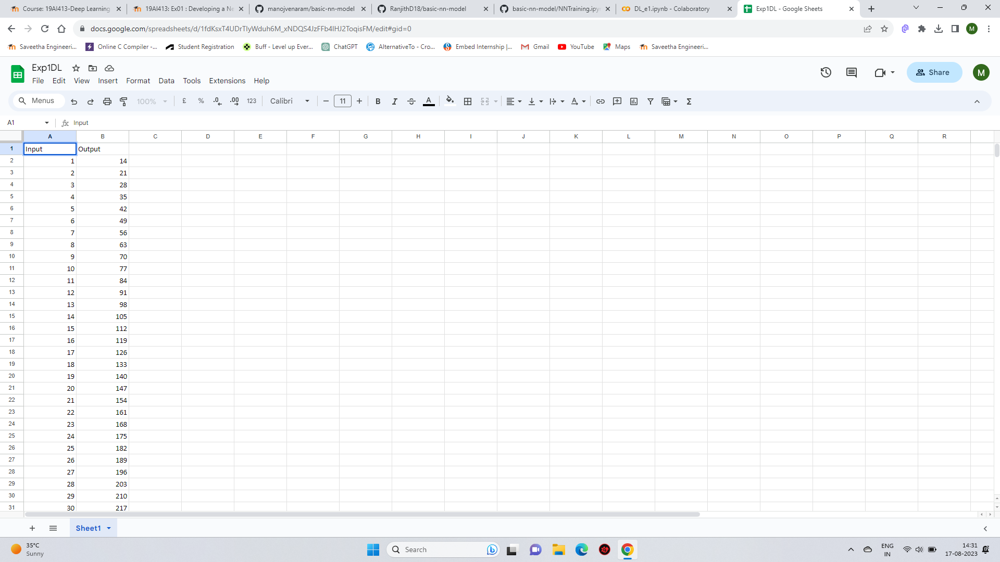
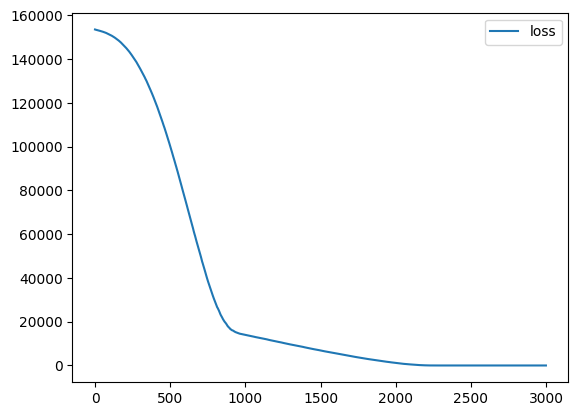
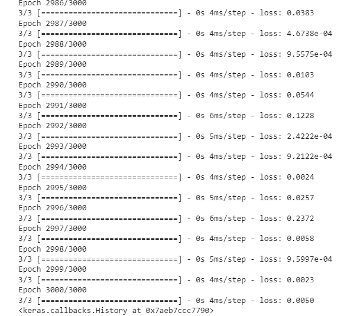
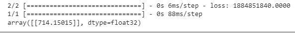

# Developing a Neural Network Regression Model

## AIM

To develop a neural network regression model for the given dataset.

## THEORY

Explain the problem statement

## Neural Network Model

Include the neural network model diagram.

## DESIGN STEPS

### STEP 1:

Loading the dataset

### STEP 2:

Split the dataset into training and testing

### STEP 3:

Create MinMaxScalar objects ,fit the model and transform the data.

### STEP 4:

Build the Neural Network Model and compile the model.

### STEP 5:

Train the model with the training data.

### STEP 6:

Plot the performance plot

### STEP 7:

Evaluate the model with the testing data.

## PROGRAM
```
from google.colab import auth
import gspread
from google.auth import default
import pandas as pd

auth.authenticate_user()
creds, _ = default()
gc = gspread.authorize(creds)

worksheet = gc.open('dp').sheet1
rows = worksheet.get_all_values()
df = pd.DataFrame(rows[1:], columns=rows[0])
df = df.astype({'Input':'float'})
df = df.astype({'Output':'float'})
df.head()
X=df[['Input']].values
y=df[['Output']].values

from sklearn.model_selection import train_test_split
X_train,X_test,y_train,y_test=train_test_split(X,y,test_size=0.33,random_state=33)

from sklearn.preprocessing import MinMaxScaler
Scaler=MinMaxScaler()
Scaler.fit(X_train)

from tensorflow.keras.models import Sequential
from tensorflow.keras.layers import Dense
ai_brain=Sequential([
    Dense(9,activation='relu'),
    Dense(11,activation='relu'),
    
    Dense(1)
])
ai_brain.compile(
    optimizer = 'rmsprop',
    loss = 'mse'
)

ai_brain.fit(X_train1,y_train,epochs = 3000)

ai_brain.evaluate(X_test,y_test)

X_n1 = [[101]]

X_n1_1 = Scaler.transform(X_n1)

ai_brain.predict(X_n1_1)

```

## Dataset Information


## OUTPUT

### Training Loss Vs Iteration Plot



### Test Data Root Mean Squared Error



### New Sample Data Prediction



## RESULT
Thus a neural network regression model for the given dataset is written and executed successfully
