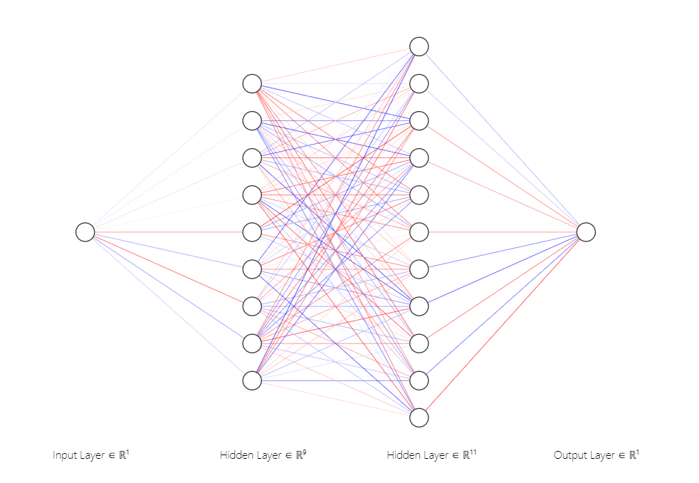

# Developing a Neural Network Regression Model

## AIM

To develop a neural network regression model for the given dataset.

## THEORY

Neurons are the basic input/output units found in neural networks. These units are connected to one another, and each connection carries a weight. Because they are adaptable, neural networks can be applied to both classification and regression. We'll examine how neural networks can be used to tackle regression issues in this post.

A relationship between a dependent variable and one or more independent variables can be established with the aid of regression. Only when the regression equation is a good fit for the data can regression models perform well. Although sophisticated and computationally expensive, neural networks are adaptable and can choose the optimum form of regression dynamically. If that isn't sufficient, hidden layers can be added to enhance prediction. Create your training and test sets using the dataset; in this case, we are creating a neural network with a second hidden layer that uses the activation layer as relu and contains its nodes. We will now fit our dataset before making a value prediction.

## Neural Network Model



## DESIGN STEPS

### STEP 1:

Loading the dataset

### STEP 2:

Split the dataset into training and testing

### STEP 3:

Create MinMaxScalar objects ,fit the model and transform the data.

### STEP 4:

Build the Neural Network Model and compile the model.

### STEP 5:

Train the model with the training data.

### STEP 6:

Plot the performance plot

### STEP 7:

Evaluate the model with the testing data.

## PROGRAM
### Importing Modules
```
from google.colab import auth
import gspread
from google.auth import default
import pandas as pd
from sklearn.preprocessing import MinMaxScaler
from sklearn.model_selection import train_test_split
from tensorflow.keras.models import Sequential
from tensorflow.keras.layers import Dense
```
### Authenticate & Create DataFrame using Data in Sheets
```
auth.authenticate_user()
creds, _ = default()
gc = gspread.authorize(creds)

worksheet = gc.open('dp').sheet1
rows = worksheet.get_all_values()
df = pd.DataFrame(rows[1:], columns=rows[0])
df = df.astype({'Input':'float'})
df = df.astype({'Output':'float'})


```
### Assign X and Y values
```
X=df[['Input']].values
y=df[['Output']].values
```
### Normalize the value & split the data
```
Scaler=MinMaxScaler()
Scaler.fit(X)
X=Scaler.fit_transforms(x)
X_train,X_test,y_train,y_test=train_test_split(X,y,test_size=0.33,random_state=33)

```
### Create a Neural Network & Train it
```
ai_brain=Sequential([
    Dense(9,activation='relu'),
    Dense(11,activation='relu'),
    
    Dense(1)
])
ai_brain.compile(
    optimizer = 'rmsprop',
    loss = 'mse'
)

ai_brain.fit(X_train1,y_train,epochs = 3000)
```
### Plot the Loss
```
loss_df = pd.DataFrame(ai_brain.history.history)
loss_df.plot()
```
### Evaluate the model
```
ai_brain.evaluate(X_test,y_test)
```
### Predict the Value
```
X_n1 = [[101]]

X_n1_1 = Scaler.transform(X_n1)

ai_brain.predict(X_n1_1)

```

## Dataset Information


## OUTPUT

### Training Loss Vs Iteration Plot


### Test Data Root Mean Squared Error


### New Sample Data Prediction


## RESULT
Thus a neural network regression model for the given dataset is written and executed successfully
